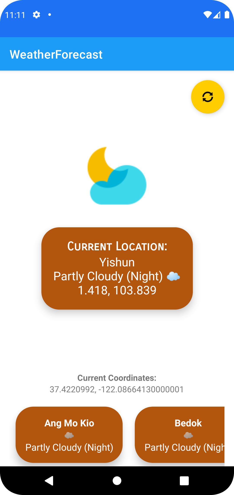

# WeatherForecast

## Deliverables 
1. README.MD
2. WeatherForecast.apk
3. Source code
4. Screenshots
5. project-report-final.pdf

## How to run
1. Install WeatherForecast.apk
2. Grant the app permission to access current location
3. Tap on the sync floating action button at the top right-hand corner to retrieve data from Web API and refresh current location
4. Weather forecast for the next 2 hours will be displayed on the center of the page
5. Scroll left/right on the bottom of the screen to view other areas' weather predictions
